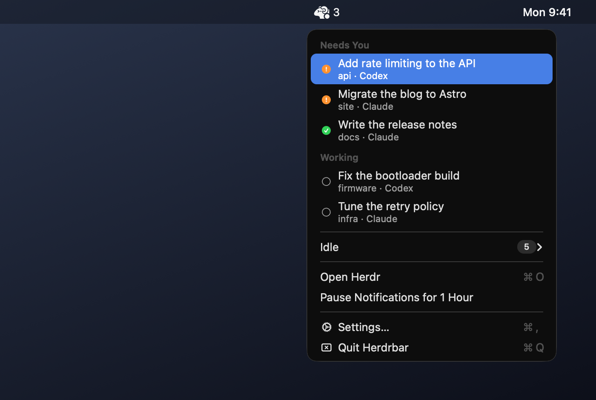
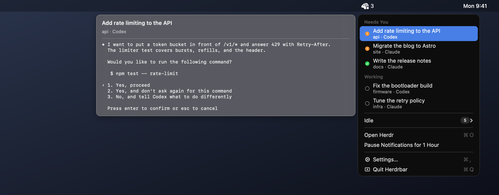
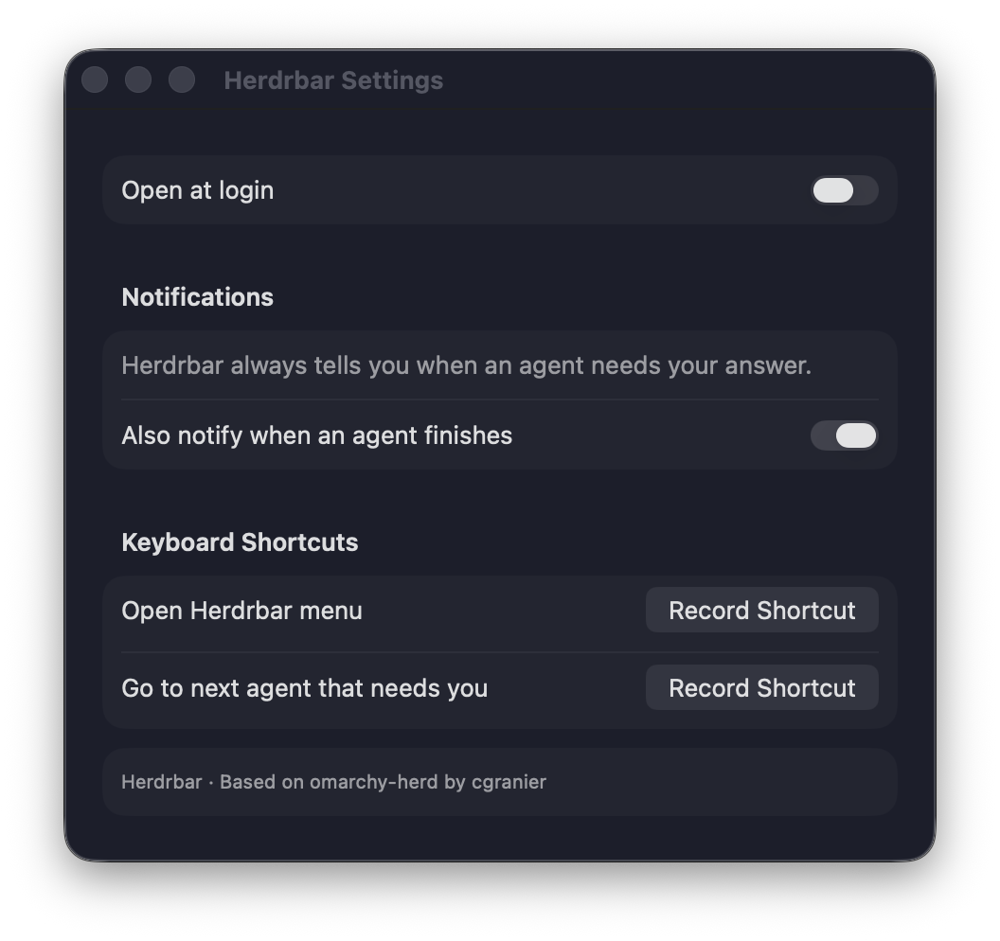

<h1 align="center">Herdrbar</h1>

<h3 align="center">Know which agent needs you.</h3>

<p align="center">
  
</p>

Herdrbar puts every [herdr](https://herdr.dev) agent in your Mac's menu bar. Agents that wait for your answer or
have finished their work are at the top, and their number is next to the icon. Click one, and herdr shows that
agent in the terminal window that runs it.

## Jump to the agent

A click focuses the agent's workspace, tab, and pane in herdr. Then the terminal window that runs herdr comes to
the front:

| Terminal | What comes forward |
|---|---|
| Ghostty, iTerm2, Terminal | The exact window and tab |
| kitty | The exact window, when remote control is on |
| Alacritty and others | The app that runs herdr |

If no herdr window is open, Herdrbar opens one in the terminal you used last.

## Peek before you jump

Point at an agent to see the last lines of its screen: the question it asks, or what it finished. Click the row to
go there.

<p align="center">
  
</p>

## Know when an agent needs you

A notification arrives when an agent is blocked, and when one finishes. Click it to jump to the agent.

Herdrbar stays quiet while herdr's own window is in front, because herdr already shows the change there. A
notification goes away when its agent no longer needs you. An agent that has waited 15 minutes gets one reminder.
To pause notifications for an hour, use the menu.

## Every machine

Agents on the SSH machines you saved in herdr (`herdr machine add`) are in the same list, marked with their
machine. A machine that can't be reached turns into one row that says why. This needs herdr 0.9.1 on both
machines.

## Install

With Homebrew:

```sh
brew tap insanearts/herdrbar https://github.com/InsaneArts/herdrbar
brew install --cask insanearts/herdrbar/herdrbar
```

Or download the zip from the [latest release](https://github.com/InsaneArts/herdrbar/releases/latest). The app is
signed and notarized for macOS 15+, on Apple Silicon and Intel.

Requirements:

- macOS 15 or newer
- herdr 0.9.0 or newer (0.9.1 for saved machines)

The first time you jump into a terminal, macOS asks whether Herdrbar may control it. Allow it to bring the exact
window forward. Without it, Herdrbar brings the terminal app forward instead.

For the exact window in kitty, turn on its remote control in `~/.config/kitty/kitty.conf`:

```conf
allow_remote_control socket-only
listen_on unix:/tmp/kitty
```

## Remove

Quit Herdrbar from its menu, then:

```sh
brew uninstall --cask --zap herdrbar
```

Without Homebrew, delete `Herdrbar.app` and `~/Library/Preferences/com.tornikegomareli.Herdrbar.plist`.

## Using it

- Click an agent to go to it. In Needs You, the agent that has waited longest is first.
- In the open menu, use the arrow keys and Return, or type the start of a title.
- Idle agents are in the Idle submenu.
- Open Herdr (⌘O) brings the herdr window forward without changing what it shows.
- The number next to the icon counts the agents that need you. A dot means at least one is blocked. A slash means
  herdr isn't running.
- Open the app again from Finder or Spotlight to show Settings.

## Settings



Choose whether Herdrbar opens at login and whether finished agents notify you. Record two keyboard shortcuts: one
opens the menu, and one goes to the next agent that needs you. Both are unset until you record them, so they
don't collide with your herdr or editor keys.

To turn notifications off completely, or to silence their sound, use System Settings > Notifications > Herdrbar.

<br clear="right" />

## Development

```sh
swift test                    # unit and integration tests
HERDRBAR_E2E=1 swift test     # also runs against a throwaway herdr session
Scripts/compile_and_run.sh    # build, sign, and launch the app
```

The E2E test starts its own herdr session and deletes it afterwards, so your running session is never touched.
To make a release, see [RELEASING.md](RELEASING.md).

## License

[MIT License](LICENSE). Herdrbar's icons are made from [herdr](https://github.com/herdrdev/herdr)'s logo (see
[NOTICE](NOTICE)). Herdrbar is not affiliated with herdr.
